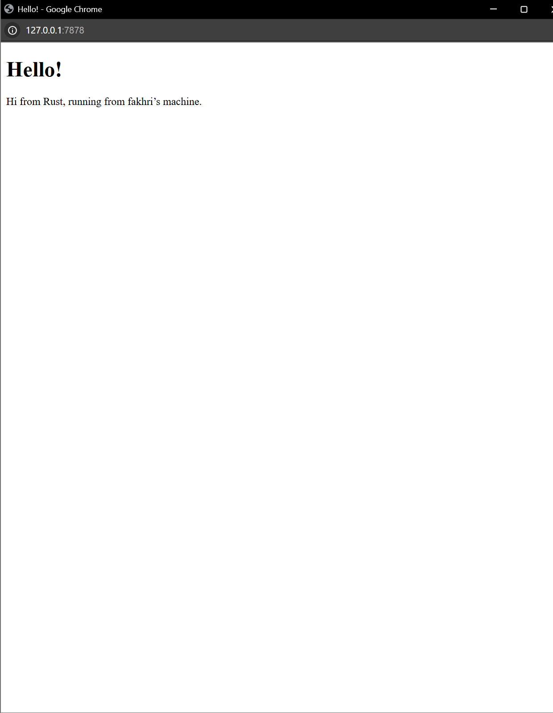

Commit 1 reflection notes

### Fungsi main.rs saat ini
Kode `src/main.rs` saat ini mengimplementasikan sebuah server TCP sederhana di Rust. Berikut adalah hal-hal yang dilakukannya:
1. **Mendengarkan Koneksi (Listening)**: Mengikat (bind) alamat IP lokal `127.0.0.1` pada port `7878` menggunakan `TcpListener`.
2. **Menerima Koneksi**: Melakukan iterasi dan menerima setiap koneksi masuk (`stream`) dari klien yang terhubung ke server tersebut.
3. **Membaca Request (handle_connection)**: Setiap `TcpStream` yang masuk akan diproses dengan membacanya menggunakan `BufReader`.
4. **Mencetak Output**: Seluruh baris dari HTTP request akan dibaca hingga terdapat baris kosong, lalu dikumpulkan dalam sebuah *Vector*, dan akhirnya dicetak (print) bentuk format debug dari HTTP request tersebut ke konsol.

Commit 2 Reflection notes

### Returning HTML
Pada commit kedua ini, fungsi `handle_connection` di `src/main.rs` telah diperbarui untuk mengembalikan file HTML ("hello.html") sebagai respons kepada klien. 
1. **Membaca File html**: Menggunakan `fs::read_to_string` untuk membaca isi `hello.html` ke dalam sebuah string.
2. **Membuat Response HTTP**: Membuat string `response` yang memiliki baris status HTTP 200 OK (`HTTP/1.1 200 OK`), header `Content-Length` sesuai panjang isi file, baris kosong penutup header HTTP, diikuti dengan isi dokumen HTML itu sendiri. 
3. **Mengirim Response**: Menggunakan `stream.write_all(response.as_bytes())` untuk menulis data respons tersebut kembali melewari jalur TCP ke klien.

 
